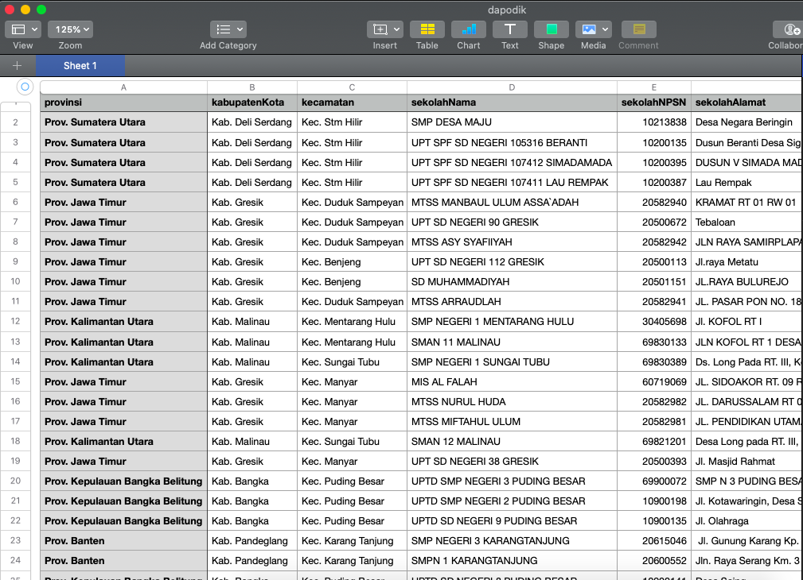

# Scraping data dapodik seluruh Provinsi Negara Indonesia

Sumber data : [dapodik](https://referensi.data.kemdikbud.go.id/index11.php)

	
### Data yang tersedia :
``` json
{
    "provinsi": "Prov. Jawa Barat",
    "kabupatenKota": "Kab. Bogor",
    "kecamatan": "Kec. Jasinga",
    "sekolahNama": "SMP N 3 JASINGA",
    "sekolahNPSN": "20200882",
    "sekolahAlamat": "Jl. Raya Jasinga Rangkas Km.08",
    "sekolahKodePos": "16670",
    "sekolahKelurahan": "Curug",
    "sekolahKecamatan": "Kec. Jasinga",
    "sekolahKabupaten": "Kab. Bogor",
    "sekolahProvinsi": "Prov. Jawa Barat",
    "sekolahStatus": "",
    "sekolahTanggalOperasi": "Sehari Penuh/5 hari",
    "sekolahJenjangPendidikan": "SMP",
    "sekolahNaungan": "Kementerian",
    "sekolahNoSKPendirian": "-",
    "sekolahTanggalSKPendirian": "1900-01-01",
    "sekolahNoSKOperasional": "315/C/KEP/MN/1999",
    "sekolahTanggalSKOperasional": "-",
    "sekolahBerkasSKOperasional": "-",
    "sekolahlAkreditasi": "A",
    "sekolahNoSKAkreditasi": "1474/BAN-SM/SK/2019",
    "sekolahDateSKAkreditasi": "16-12-2019",
    "sekolahNoSertifikasiISO": "9001:2008",
    "sekolahLuasTanah": "1 m2",
    "sekolahAksesInternet": "XL (GSM)",
    "sekolahSumberListrik": "PLN & Diesel",
}
```